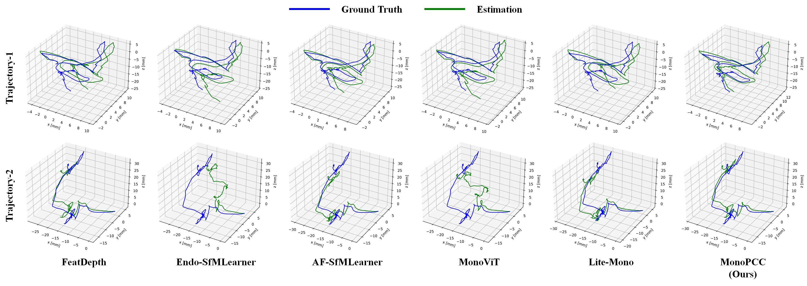

# MonoPCC

This is a PyTorch implementation for **MonoPCC: Photometric-invariant Cycle Constraint for Monocular Depth Estimation of Endoscopic Images**.

## ⚙️ Setup

Our experiments are conducted in a [conda](https://www.anaconda.com/download) environment (python 3.7 is recommended) and you can use the below commands to install necessary dependencies:
```shell
pip3 install torch==1.9.0+cu111 torchvision==0.10.0+cu111 torchaudio==0.9.0
pip install dominate==2.4.0 Pillow==6.1.0 visdom==0.1.8
pip install tensorboardX==1.4 opencv-python  matplotlib scikit-image
pip3 install mmcv-full==1.3.0 mmsegmentation==0.11.0  
pip install timm einops IPython
```


## 💾 Data Preparation

The datasets in our experimental results are [SCARED](https://endovissub2019-scared.grand-challenge.org)(additional application to max.allan@intusurg.com is necessary), [SimCol3D](https://www.ucl.ac.uk/interventional-surgical-sciences/simcol3d-3d-reconstruction-during-colonoscopy-challenge) and [SERV-CT](https://www.ucl.ac.uk/interventional-surgical-sciences/serv-ct).

**SCARED split**

The training/test split for SCARED in our works is defined in the `splits/endovis` and further preprocessing is available in [AF-SfMLearner](https://github.com/ShuweiShao/AF-SfMLearner).


## 📊 Evaluation on SCARED

To prepare the ground truth depth maps, please follow the [AF-SfMLearner](https://github.com/ShuweiShao/AF-SfMLearner/blob/main/export_gt_depth.py). Moreover, here we provide the [model files](https://drive.google.com/drive/folders/13A9TZDETPgEm3D-c37YsGHn8OZcd-VMh?usp=sharing) to reproduce the reported results.

To evaluate model performance on SCARED, you need to run the following command: 
```shell
CUDA_VISIBLE_DEVICES=0 python evaluate_depth.py --data_path <your_data_path> --load_weights_folder <your_weight_path> \
    --eval_split endovis --dataset endovis  --max_depth 150 --png --eval_mono
```

After that, you can acquire the below evaluation results (the model files and prediction results of SOTAs are also provided [here](https://drive.google.com/drive/folders/1Z75I9xL5BKymm-nMdkKOrJzi3pdT3nde?usp=sharing) for statistical analysis, e.g., [T-test](https://docs.scipy.org/doc/scipy/reference/generated/scipy.stats.ttest_rel.html)): 

| `Methods`          | Abs Rel| Sq Rel| RMSE| RMSE log|  $\delta$ < 1.25  |
|-----------------------|----|----|----|------|--------|
| `Monodepth2`          | 0.060    | 0.432   | 4.885 | 0.082     | 0.972      |
| `FeatDepth`   | 0.055    | 0.392   | 4.702 | 0.077     | 0.976      |
| `HR-Depth`         | 0.058    | 0.439   | 4.886 | 0.081     | 0.969      |
| `DIFFNet`  | 0.057    | 0.423   | 4.812 | 0.079     | 0.975      |
| `Endo-SfMLearner` | 0.057    | 0.414   | 4.756 | 0.078     | 0.976      |
| `AF-SfMLearner`   | 0.055    | 0.384   | 4.585 | 0.075     | 0.979      |
| `MonoViT`        | 0.057    | 0.416   | 4.919 | 0.079     | 0.977      |
| `Lite-Mono`        | 0.056     | 0.398  | 4.614  | 0.077    | 0.974    |
| `MonoPCC(Ours)`         | **0.051** |**0.349**| **4.488**| **0.072**| **0.983**|

Note that, since our training split is slightly different from [AF-SfMLearner](https://github.com/ShuweiShao/AF-SfMLearner), we supplement the comparison results using their training setting [here](./evaluation_results/AF_training_split/).


## 🔌 Plug and Play

As a plug-and-play design, PCC can theoretically be embedded into any backbone network. In addition to the previously used [MonoViT](https://arxiv.org/abs/2208.03543), we extend the PCC strategy to the more recent methods, e.g., [EndoDAC](https://arxiv.org/abs/2405.08672), achieving the following results:

| `Methods`          | Abs Rel| Sq Rel| RMSE| RMSE log|  $\delta$ < 1.25  |
|-----------------------|----|----|----|------|--------|
| `EndoDAC`         | 0.051    | 0.341   | 4.347 | 0.072     | **0.981**      |
| [`EndoDAC+PCC`](https://drive.google.com/drive/folders/1NDMVER9BBkP0BW-KkNLV9jgXojeFgYXG?usp=sharing)         | **0.049** |**0.334**| **4.322**| **0.070**| **0.981**|


## ➰ Pose estimation

We also evaluate the performance of pose estimation. Before that, please please follow [AF-SfMLearner](https://github.com/ShuweiShao/AF-SfMLearner/blob/main/export_gt_pose.py) and prepare the ground truth. 

Using the [PoseNet models](https://drive.google.com/drive/folders/13A9TZDETPgEm3D-c37YsGHn8OZcd-VMh?usp=sharing), you can run the below command to acquire the results of pose estimation on two trajectories:
```shell
CUDA_VISIBLE_DEVICES=0 python evaluate_pose.py --data_path <your_data_path> --load_weights_folder <your_weight_path> 
```

### Visual trajectory



## 🎞️ Demo of 3D reconstruction

Here we use MonoPCC to estimate depth maps for a video sequence in SCARED, and then perform 3D reconstruction ([ElasticFusion](https://github.com/mp3guy/ElasticFusion)) with the RGB and pseudo depth data:


## 🚗 Results of KITTI

To further demonstrate the effectiveness of MonoPCC in more general scenarios, we conduct comparison experiment on [KITTI](http://www.cvlibs.net/datasets/kitti/raw_data.php) dataset. Here we exhibit SOTAs mentioned in our paper, and provide the [depth models](https://drive.google.com/drive/folders/1fgYf8q-9vnyrpAsUjsKlSYrWpwW0jpYH?usp=sharing) to validate the below experimental results. 

| `Methods`          | Abs Rel| Sq Rel| RMSE| RMSE log|  $\delta$ < 1.25  |
|-----------------------|----|----|----|------|--------|
| [`Monodepth2`](https://github.com/nianticlabs/monodepth2)          | 0.115 |0.903 |4.863| 0.193 |0.877 |
| [`FeatDepth`](https://github.com/sconlyshootery/FeatDepth)   | 0.104| 0.729| 4.481| 0.179| 0.893|
| [`HR-Depth`](https://github.com/shawLyu/HR-Depth)         | 0.109|  0.792|  4.632|  0.185|  0.884|
| [`DIFFNet`](https://github.com/brandleyzhou/DIFFNet)  | 0.102 |0.749 |4.445 |0.179 |0.897 |
| [`MonoViT`](https://github.com/zxcqlf/monovit)         | 0.099 |0.708 |4.372| 0.175 |**0.900** |
| [`Lite-Mono`](https://github.com/noahzn/Lite-Mono)         | 0.101 |0.729| 4.454| 0.178| 0.897|
| `MonoPCC(Ours)`         | **0.098** |**0.677**| **4.318**| **0.173**| **0.900**|

To be specific, please run the following command:
```shell
CUDA_VISIBLE_DEVICES=0 python evaluate_depth_kitti.py --data_path <kitti_data_path> --load_weights_folder <your_weight_path> \
    --eval_split eigen --dataset kitti --eval_mono
```


## ⏳ To do

Currently, we have released the evaluation code and model weight files of MonoPCC, which can reproduce the result in our work. In the near future, we will continue to update the complete training code. 

## Acknowledgement
Thanks the authors for their works:

[MonoViT](https://github.com/zxcqlf/monovit)

[AF-SfMLearner](https://github.com/ShuweiShao/AF-SfMLearner)

[EndoDAC](https://github.com/BeileiCui/EndoDAC)
